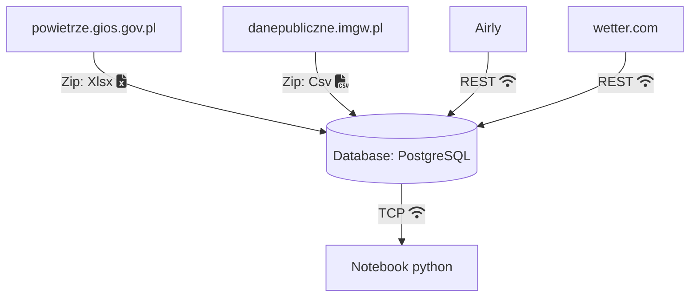

## Temat
3. Przewidywanie poziomu zanieczyszczenia powietrza w Krakowie i okolicach na podstawie danych z czujników Airly i sytuacji pogodowe

## Linki

- https://docs.google.com/document/d/1A4vf6-44v6pEoVfWlZY5T6w5sXWa10URgPM9IqERqiM/edit

## Architektura

